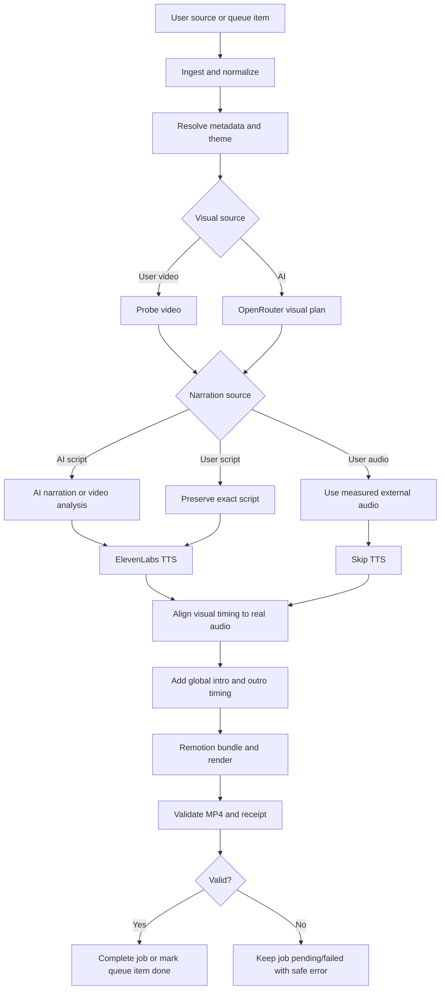
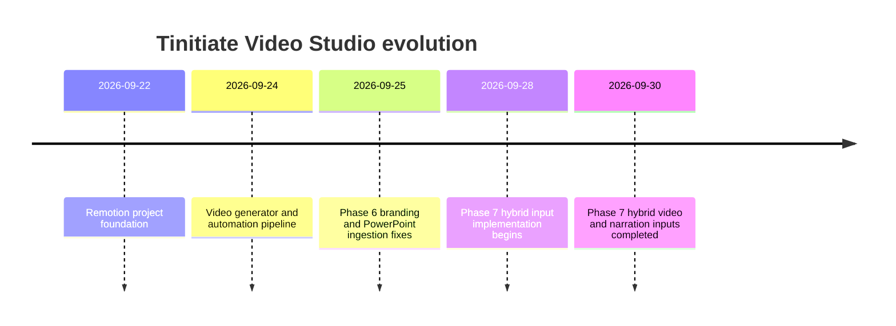

# Tinitiate Video Studio: Project Overview

## What this project does

Tinitiate Video Studio turns learning material into a narrated technical MP4. A source can be Markdown, plain text, PDF, Word, PowerPoint, a readable HTTPS page, or a supported remote document. The application extracts text, creates a structured visual plan, prepares narration, renders the plan with Remotion, validates the result, and keeps the job and its history in local managed storage.

This documentation describes the repository at the Phase 7 hybrid-input implementation (`868247e`, `phase-7-hybrid-inputs`). It separates behavior that is implemented and tested from ideas that are only possible future extensions.

## Read this first

- New users: start with [USER-GUIDE.md](USER-GUIDE.md).
- Choosing inputs: see [INPUT-MATRIX.md](INPUT-MATRIX.md).
- Understanding the full flow: see [PIPELINE-FLOW.md](PIPELINE-FLOW.md).
- Maintaining the code: see [ARCHITECTURE.md](ARCHITECTURE.md) and [TESTING.md](TESTING.md).
- Diagnosing a failed job: see [TROUBLESHOOTING.md](TROUBLESHOOTING.md).

## Current capabilities

| Area | Implemented behavior |
| --- | --- |
| Source ingestion | Local `.md`, `.txt`, `.pdf`, `.docx`, `.pptx`; safe HTTPS document and webpage ingestion |
| AI planning | OpenRouter produces a validated JSON `VideoPlan` using only supported scene types |
| Narration | AI-generated script, exact user script sent to ElevenLabs, or user audio that bypasses TTS |
| Visuals | AI-planned Remotion scenes or an authoritative uploaded user video |
| Hybrid inputs | All six visual/narration combinations are covered by tests |
| Timing | Local media probing plus timestamp-based or measured audio alignment |
| Branding | Shared brand identity, dynamic or uploaded intro/outro, logo, CTA/contact data, optional HTTPS QR code |
| UI | Create Video, Job Queue, Scheduler, Completed Videos, job detail, Settings, and branding settings |
| Safety | Local-only UI, SSRF-resistant HTTPS fetching, managed uploads, bounded files, allowlisted artifacts, redacted errors |
| Validation | Video dimensions, FPS, duration, frame count, playable video, audio stream, and voiceover fit |

## Unified pipeline

## The six supported combinations

The two independent choices are the visual source and the narration source:

1. AI visuals + AI narration
2. AI visuals + user narration script
3. AI visuals + user narration audio
4. User video + AI narration
5. User video + user narration script
6. User video + user narration audio

The exact provider calls and authority rules are documented in [07-PHASE-7-HYBRID-INPUTS.md](07-PHASE-7-HYBRID-INPUTS.md) and [INPUT-MATRIX.md](INPUT-MATRIX.md).

## Authority rules

- A user video is the authoritative visual source. The renderer plays it rather than replacing it with generated scenes.
- A user narration script is persisted verbatim and is sent to ElevenLabs without rewriting.
- User narration audio is authoritative and bypasses ElevenLabs completely.
- AI is used only for missing pieces. A user video plus user script therefore needs no visual planner, video analysis, or rewritten narration.
- Global branding is resolved outside the AI plan. The planner does not invent intro, outro, QR, or contact details.

## Development history

The repository history identifies these broad milestones:

The phase documents use the requested Phase 1–7 names to explain the evolution of the system. The Git history does not contain a separate release tag for every numbered phase, so Phase 1–5 describe the corresponding implemented layers rather than claiming a separate tag that is not present.

## Implemented versus future

Implemented behavior is described with present-tense language and is backed by source code or tests. Future extensions are explicitly labeled. Examples of future extensions include multi-track editing, OCR for embedded document images, automatic captions, more visual source types, and remote/cloud job storage. None of those should be presented as current functionality.

## Repository map

| Path | Responsibility |
| --- | --- |
| `src/automation/` | Source loading, planning, narration, timing, rendering, validation, branding, and queue CLI |
| `src/server/` | Local HTTP API, ingestion, SQLite job repository, worker, and security boundaries |
| `src/web/` | Browser UI for creation, queue, scheduling, job detail, settings, and branding |
| `src/compositions/` | Remotion compositions, including `DynamicVideo` |
| `src/scenes/` | Remotion scene components and the authoritative user-video scene |
| `tests/ui/` | Playwright workflows for the local UI |
| `automation.config.json` | Provider, video, narration, audio, render, and validation settings |
| `themes.json` | Theme catalog and active theme |

