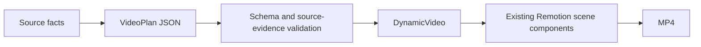

# Phase 1: Foundation

## Purpose

The foundation is the original Remotion application plus the contracts that make generated video data safe to render. It provides the visual runtime, theme model, source metadata, and validation rules used by every later phase.

## What the foundation contains

The repository began as a Remotion project. The important foundation pieces are:

- `src/index.ts` and `src/Root.tsx` register Remotion compositions.
- `src/compositions/DynamicVideo.tsx` renders a `VideoPlan` as Remotion sequences.
- `src/scenes/` contains reusable scene components.
- `themes.json` contains named visual themes.
- `src/automation/types.ts` defines Zod schemas and TypeScript types for configuration, themes, plans, audio, branding, and hybrid inputs.
- `src/automation/validate.ts` checks the rendered media rather than trusting the plan alone.

## The plan is data, not JSX

The planner returns a JSON `VideoPlan`. It does not return React code and does not choose arbitrary component names. The plan contains the title, theme, dimensions, frame count, contact information, continuous narration, and a list of scenes. Remotion maps each scene `type` to an existing component.



Supported scene types are:

- `hero-title`
- `process-flow`
- `feature-grid`
- `technology-stack`
- `project-showcase`
- `code`
- `diagram`
- `metrics`
- `cta`
- `brand-intro` and `brand-outro`, which are added by the branding layer rather than requested from the AI planner

Technical payloads are deliberately typed. A code scene must have a code payload, a diagram scene must have a diagram payload, and a metrics scene must have a metrics payload. Unused payloads are `null`.

## Themes

Themes live in `themes.json`. Each theme supplies colors, font family, heading weight, card style, transition family, CTA style, music style, and sound-effect style. The current catalog includes:

- Tinitiate Dark Yellow
- Future Neon Blue
- AI Purple Gradient
- Cloud Orange
- Corporate Clean Light

A plan references a theme ID. The plan and the resolved theme are checked together so that a plan cannot silently render using a different visual contract.

## Source metadata and frontmatter

Markdown sources can provide presentation metadata using plain YAML frontmatter. The resolver accepts content fields such as title, slug, brand, duration mode, resolution, theme, video type, voiceover mode, CTA, website, email, phone, address, and tagline. Unknown keys are not treated as executable configuration.

Example:

```markdown
---
title: AWS Data Engineering
slug: aws-data-engineering
duration_mode: auto
theme: future-neon-blue
voiceover_mode: auto
---

# AWS Data Engineering

The source content starts here.
```

When fields are omitted, the application resolves them from `automation.config.json`, `themes.json`, the first H1, or the source filename as appropriate. Fixed duration requires a valid duration. Auto duration must not be given a conflicting `duration_seconds` value.

## Early safety boundaries

The foundation treats source material as reference data. Source text cannot override provider settings, output paths, schema rules, or system instructions. The planner is expected to use source-supported facts, and local validation checks source identity, dimensions, frames, scene continuity, contact values, theme, and technical scene evidence.

## Why later phases depend on this foundation

The later automation and UI layers do not replace the Remotion foundation. They produce the inputs it expects, add managed storage and job control, and add alternative authoritative media paths. This is why an external user video can be inserted into the same composition while keeping the same theme, branding, audio mix, and final validation contract.

