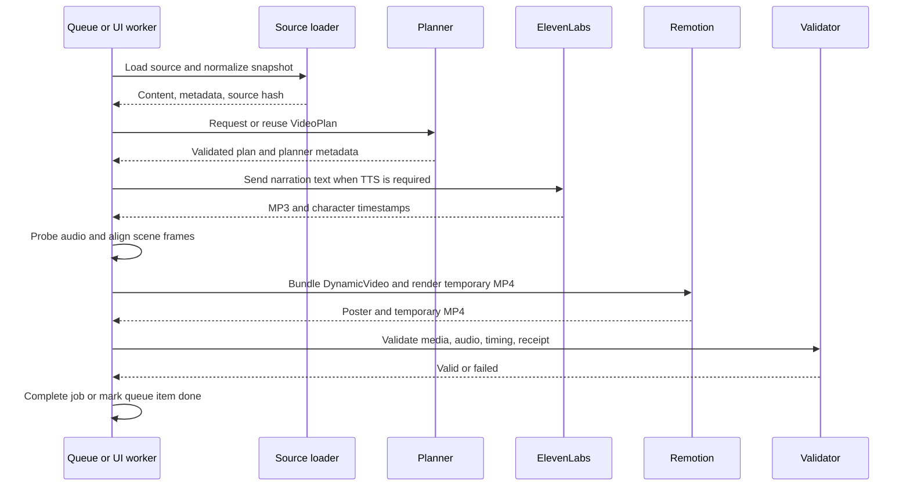

# Phase 2: Automation Pipeline

## Purpose

Phase 2 turns the Remotion foundation into a repeatable source-to-video process. It supports a Markdown queue, standalone sources, normalized content, OpenRouter planning, ElevenLabs narration, caching, rendering, validation, and queue completion.

## Ways to run it

From the repository root:

```powershell
npm.cmd run videos
npm.cmd run videos -- --plan-only
npm.cmd run video:preview
npm.cmd run videos -- --validate --input .\inputs\ml-engineering.md
```

The exact scripts are in `package.json`. The UI worker uses the same engine through the server adapter; it does not implement a separate video pipeline.

## Queue behavior

The CLI queue is `video-source.md`. Each bullet is one source. Queue entries are processed in order. A line is marked `<!-- done -->` only after the final MP4 passes validation. A failed or unvalidated entry stays pending. `--force` permits already completed entries to be considered again, but it does not bypass schema, timing, or output validation.

The runner uses an exclusive `output/.automation.lock` so two renderers do not use the shared generated assets at once. If a process crashes, confirm that it has stopped before removing the lock.

## Source loading and normalization

Local and remote sources become a normalized snapshot. The loader removes a leading UTF-8 BOM and converts CRLF or CR line endings to LF. The SHA-256 source hash is calculated from the normalized content. Remote Markdown is fetched again when a pending URL is processed, so changed content at the same URL invalidates planning.

Supported queue references include local Markdown, generic HTTPS Markdown, GitHub blob Markdown URLs, and `raw.githubusercontent.com` URLs. The server ingestion layer additionally handles text, PDF, DOCX, PPTX, and readable webpages.

## Planning

The OpenRouter planner implements the existing `Planner` interface. It sends source content, resolved metadata, selected theme, exact video settings, narration policy, and a generated strict JSON schema. It expects one JSON object and locally validates it with the project’s Zod schemas.

The planner is constrained to the existing scene types. It produces data, not JSX. It must preserve source identity, source-backed evidence, theme, dimensions, FPS, contact details, and frame arithmetic. A bad or stale plan cannot replace a valid cached plan.

Planner cache reuse requires a matching fingerprint containing the normalized source hash, theme, planner settings, prompt/schema version, video settings, narration settings, and actual prompt/schema messages. The cached plan, metadata, and plan hash must all validate.

## Narration, render, and validation

For AI narration, the runner writes `voiceover.txt`, reads it back, sends only that narration text to the TTS adapter, measures the resulting audio, aligns scene timing, adds branding timing, and renders. Audio is never sped up to make it fit.

Remotion bundles `src/index.ts`, selects the `DynamicVideo` composition, creates a poster, renders a temporary MP4, validates the temporary file, and only then renames it to `final.mp4`. A render receipt contains fingerprints for the props, assets, source code, package lock, and output bytes. Valid matching renders can be reused.

## Pipeline sequence



## Generated artifacts

Typical per-video output contains:

| Artifact | Purpose |
| --- | --- |
| `source.md` | Exact source snapshot used for the run |
| `metadata.json` | Resolved content and provider metadata |
| `video-plan.json` | Authored visual/narration plan |
| `planner-cache.json` | Planner fingerprint and plan metadata |
| `voiceover.txt` | Narration sent to TTS, or the external script |
| `narration-budget.json` | Pre-TTS budget or external audio measurement |
| `audio/` | TTS output and audio cache when applicable |
| `video-analysis.json` | User-video analysis for user-video + AI-script jobs |
| `render-plan.json` | Plan after actual-audio timing and branding |
| `renders/final.mp4` | Validated output |
| `renders/poster.png` | Rendered still used by the UI |
| `renders/render-receipt.json` | Render and output hash receipt |
| `validation.json` | Validation checks and errors |
| `logs/run.log` | Local run log |

## Provider boundaries

Preview, validation-only, offline UI mode, and test fixtures are designed to avoid provider calls. Real OpenRouter planning requires `OPENROUTER_API_KEY`. Real ElevenLabs generation requires `ELEVENLABS_API_KEY` and a configured voice ID. Starting a worker with a queued real job is the action that can call paid providers.
