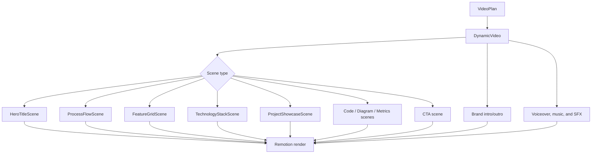

# Phase 4: Dynamic Video

## Purpose

Phase 4 makes one Remotion composition data-driven. The same `DynamicVideo` component can render different source topics, themes, scene counts, durations, narration tracks, branding settings, and hybrid media without generating new React code for every video.

## How Remotion is used

`DynamicVideo` receives `VideoProps`:

```text
plan       VideoPlan
theme      ThemeConfig
audio      voiceover, music, and optional SFX assets
mix        voice/music/SFX volume settings
branding   resolved intro/outro and identity
hybrid     optional user-video or external-audio asset references
```

The root composition uses `calculateMetadata` so duration, FPS, width, and height come from the plan. The renderer bundles the entry point with the public asset directory, selects `DynamicVideo`, renders a poster, and then renders H.264 video with AAC audio.

## Scene sequencing

Each scene has `startFrame` and `durationInFrames`. `DynamicVideo` places it in a Remotion `Sequence`. Each scene component receives the scene, theme, plan, and branding. Transitions, particles, typography, cards, code, diagrams, metrics, and CTA layouts are implemented by the existing scene components.



## AI visuals

When the visual source is AI, OpenRouter creates a structured plan from source-backed facts. It chooses among the supported scene types and supplies technical payloads where appropriate. Local validation rejects invented code, unsupported code evidence, unsupported diagram evidence, and metrics without source evidence.

The planner must not request `brand-intro` or `brand-outro` scenes. Global branding is applied after planning, which keeps the brand identity consistent and outside untrusted source instructions.

## User video visuals

When the visual source is `USER_VIDEO`, the runner creates a minimal plan for the uploaded video. During the content portion of the composition, `UserVideoScene` plays the staged public asset using Remotion’s `Video` component and `objectFit="cover"`. It uses the configured default user-video volume of 0.15 unless the runtime props override it.

Ordinary generated visual scenes are suppressed for a user-video job. Global branding intro and outro remain available, so the effective structure is:

```text
global intro → user video → global outro
```

The uploaded video is not replaced by AI-generated visuals. AI may still generate missing narration when the selected narration source is `AI_SCRIPT`.

## Timing and composition constraints

The plan schema requires:

- positive duration and FPS;
- `totalFrames = durationSeconds * fps`;
- scenes starting at frame zero;
- contiguous scenes with no gaps or overlaps;
- scene durations of at least one frame;
- a unique scene ID for each scene;
- scene narration equal to the continuous narration for AI narration;
- compatible technical payloads.

These rules protect the renderer from ambiguous timing and are checked before final media validation.

## What is not implemented

The composition is not a general nonlinear editor. It does not currently expose arbitrary timeline tracks, arbitrary user-selected crop paths, automatic subtitles, or a general-purpose scene/plugin registry. Those would be future extensions rather than current user options.

