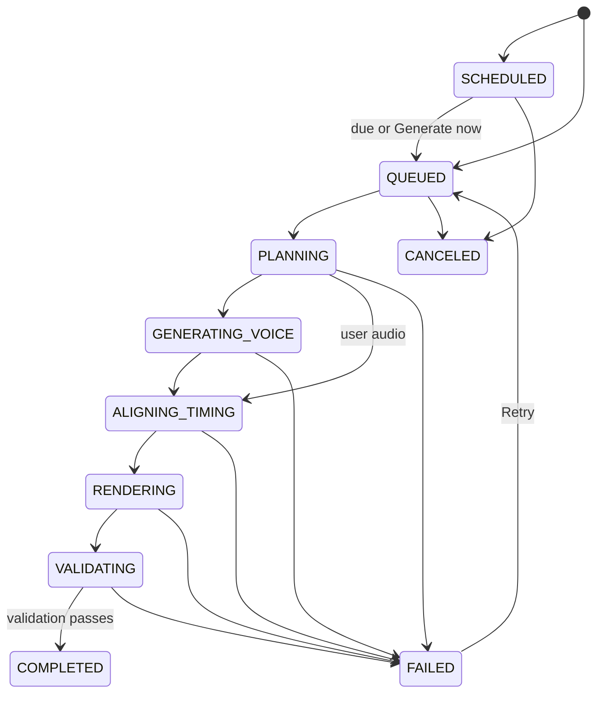

# Phase 5: UI, Queue, Scheduler, and Ingestion

## Starting the local application

Install dependencies once, then build and start the local UI:

```powershell
npm.cmd install
npm.cmd run ui
```

Open `http://localhost:3100`. The server binds to loopback. For browser-only verification that cannot execute jobs:

```powershell
npm.cmd run ui:offline
```

The worker starts paused by default unless settings request auto-start. This lets a user inspect the UI and create jobs before intentionally starting provider-backed work.

## Main pages

| Page | Use it for |
| --- | --- |
| Create Video | Add a source, choose regular or Hybrid Inputs, choose branding, and create or schedule jobs |
| Job Queue | Review pending, active, failed, and canceled jobs |
| Scheduler | Review future jobs and due jobs waiting for the worker |
| Completed Videos | Search validated outputs and open previews/downloads |
| Job detail | Inspect source provenance, plan, narration, measured audio, events, and output |
| Settings | Select theme/duration defaults, configure worker behavior, and see provider configuration status |
| Video branding | Edit global brand identity, intro/outro, logo, uploads, and local branding preview |

## Creating a regular job

1. Open **Create Video**.
2. Choose **Upload Files** for local Markdown, text, PDF, Word, or PowerPoint files, or choose **HTTPS Sources** and enter URLs.
3. Select a theme and either auto duration or fixed duration.
4. Choose **Generate now** or a future schedule time.
5. Create the jobs. Each source becomes one independent job.
6. Open **Settings** and press **Start worker** when you are ready for generation.

For a source URL, the UI validates the URL before job creation. A remote job may fetch its source when the worker claims it, so a URL can fail later if the remote content changes or becomes unavailable.

## Creating a Hybrid Inputs job

1. Open **Create Video** and choose **Hybrid Inputs**.
2. Select **AI-generated visuals** or **Use my existing video**.
3. Select **AI-generated narration**, **My narration script**, or **My narration audio**.
4. Supply the fields that the choices require:
   - AI visuals require a source file or source URL.
   - User video requires `.mp4`, `.webm`, or `.mov`.
   - User script requires exact spoken text.
   - User audio requires `.mp3`, `.wav`, `.m4a`, `.aac`, `.ogg`, or `.webm`.
   - AI-generated narration requires a first-person or third-person viewpoint.
5. Choose branding and timing, then create the job.

The UI explains that supplied video, script, and audio are authoritative. The exact provider behavior is in [INPUT-MATRIX.md](INPUT-MATRIX.md).

## Source ingestion

Local source uploads are copied into managed job storage and normalized before the job is queued. Markdown and text must be valid UTF-8. PDFs must have a PDF signature and extractable text. DOCX and PPTX are ZIP-based Office files and are text-extracted. Embedded images are listed as metadata; OCR and image interpretation are not performed.

The ordinary source upload endpoint accepts at most 20 files and applies a 20 MB per-source limit. The Hybrid Inputs multipart endpoint accepts up to three files and has a 100 MB multipart file limit; document validation still applies the 20 MB source limit, while user video/audio extensions and media probing are checked separately.

## Job states



The repository records stage events with timestamps and attempts. Completion requires an independently checked validation result and render receipt.

## Scheduler and actions

The UI supports Generate now, Retry, Cancel, and Reschedule. A future schedule must be in the future. A paused worker can still accept and store jobs; it simply does not claim them. Offline mode rejects attempts to start the worker.

## Managed storage

The default locations are:

- `data/jobs.sqlite`: jobs and stage events;
- `inputs/job-uploads/<job-id>/`: original and normalized source files plus managed hybrid assets;
- `output/jobs/job-<job-id>/`: plans, audio, renders, validation, and logs;
- `public/branding/`: validated shared branding assets;
- `public/generated/<slug>/`: staged public references for user video and user narration audio during rendering.

Do not edit these locations while the local server is running. Job detail exposes an allowlisted subset of structured artifacts, not raw provider logs or environment files.

