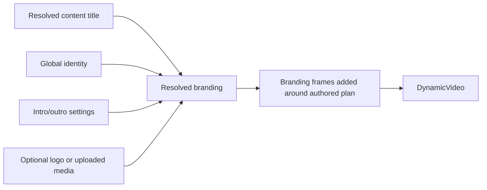

# Phase 6: Global Branding and PowerPoint Ingestion

## Global branding

Branding is resolved centrally from `automation.config.json` and the **Video branding** page. It applies to new jobs, and each job stores its resolved branding so a later global change does not rewrite an existing job.

The shared identity contains:

- brand name;
- tagline;
- CTA;
- website;
- email;
- phone;
- address.

The identity must be complete before a branded render can be resolved.

## Intro and outro modes

Each global slot supports:

- `dynamic`: Remotion renders the slot from the configured identity and options;
- `uploaded`: use a validated MP4 or WebM asset;
- `none`: omit the slot.

The default dynamic intro is four seconds and can animate the logo, brand name, tagline, and hold. The default dynamic outro is five seconds and can show the video title, contact details, tagline, and CTA. Durations are converted to frames using the configured FPS.

The planner does not create branding scenes or invent contact values. The branding layer adds `global-brand-intro` and `global-brand-outro` scenes after planning and shifts the authored scene frames accordingly.

## Assets and QR codes

The UI accepts PNG, JPG, or WebP for the logo and MP4 or WebM for intro/outro assets. Files are signature/probe checked, stored under managed `public/branding/`, and served through an allowlisted route. A dynamic outro can generate a QR code only when an explicit HTTPS destination is configured. An arbitrary local path is not accepted.

Branding preview resolves local settings and a sample title. It does not call OpenRouter or ElevenLabs.

## PowerPoint and Office ingestion

PPTX files are ZIP-based Office documents. The ingestion layer reads slide text and preserves slide numbers in normalized sections. DOCX paragraphs are handled similarly. Embedded media can be listed in provenance metadata and warnings, but the current implementation does not perform OCR or image interpretation on those embedded images.

The extracted text becomes the source material for planning. A source with no usable text or one whose extracted content exceeds the configured extraction limit is rejected before planning.

## Branding precedence

The effective values are resolved in this order:

1. job-level intro/outro mode override from Create Video;
2. the global branding configuration;
3. dynamic fallback when an uploaded slot is selected but no valid asset remains.

The global identity itself comes from the saved configuration. The job snapshot protects completed or queued work from future global edits.

