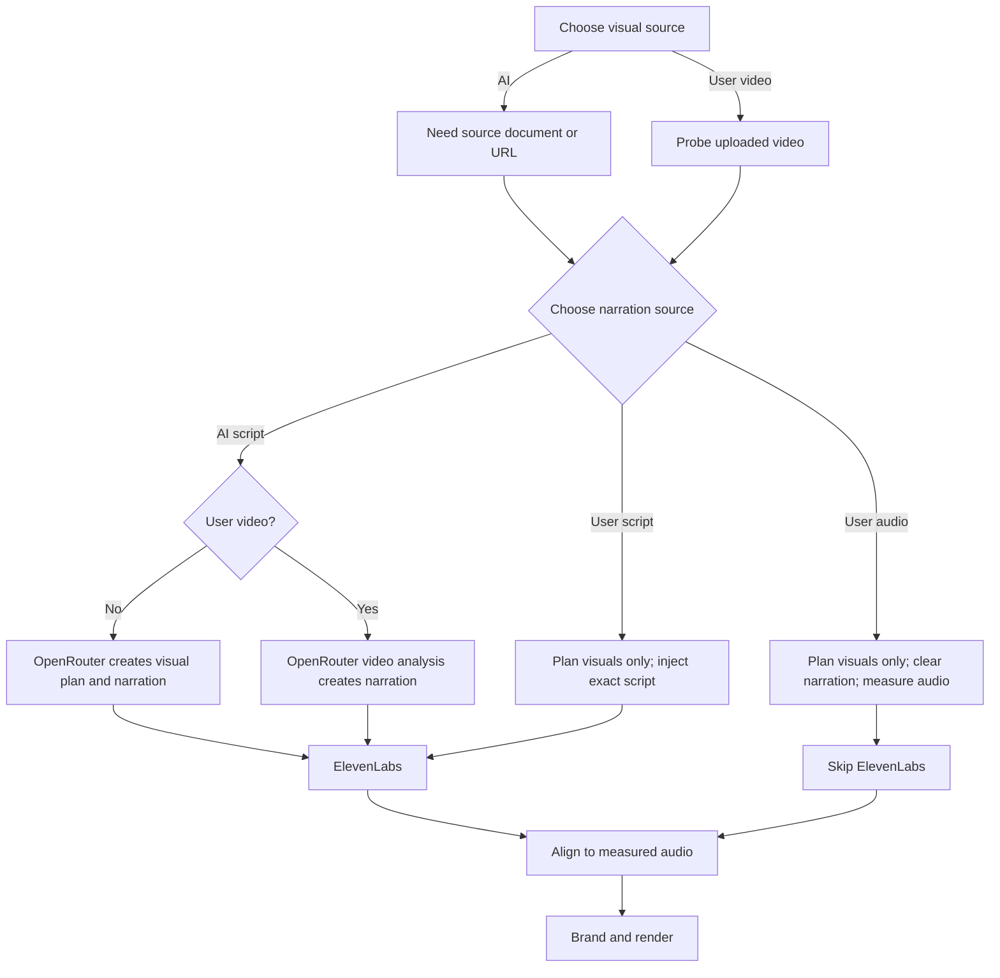

# Phase 7: Hybrid Inputs

## Objective

Phase 7 separates two decisions that were previously coupled:

1. Who supplies the visuals?
2. Who supplies the narration?

The result is one unified pipeline with six supported combinations. The pipeline only creates missing components and treats supplied media as authoritative.

## Capability matrix

| Visual source | Narration source | Visual planner | Video analysis | ElevenLabs | Authority |
| --- | --- | ---: | ---: | ---: | --- |
| AI | AI script | Yes | No | Yes | AI plan and AI narration |
| AI | User script | Yes | No | Yes | User script; AI plans visuals |
| AI | User audio | Yes | No | No | User audio; AI plans visuals |
| User video | AI script | No | Yes | Yes | User video; AI writes narration from it |
| User video | User script | No | No | Yes | User video and user script |
| User video | User audio | No | No | No | User video and user audio |

These six combinations are exercised by the Phase 7 capability and runner tests.

## Decision flow

## AI visuals

AI visuals require a source document or HTTPS source. OpenRouter receives the source content, resolved metadata, theme, and rules for supported scenes. The planner does not receive a user narration script or user narration audio as source material. For external narration, the prompt explicitly requests visual planning only and marks narration as external.

## User video

User video accepts `.mp4`, `.webm`, or `.mov`. The server probes it before creating the job. The runner stages it into a managed public reference for Remotion and creates a plan whose visual content is the uploaded video. Generated visual scenes are not used for the content portion of the user-video render.

For user video plus AI narration, the configured `planner.videoModel` is used for video-context analysis. The video is encoded as a data URL for the OpenRouter analysis request. The analysis is instructed to describe only what is visible or clearly audible, preserve the supplied video sequence, and avoid invented facts. Its narration is then sent to ElevenLabs.

For user video plus a user script or user audio, no video analysis is needed. The user-provided narration is authoritative.

## User narration script

The script field is intended for exact spoken text. The pipeline:

1. checks that it is nonempty;
2. preserves the exact text in `voiceover.txt` and the plan;
3. allocates unchanged slices to visual scenes by duration;
4. checks the pre-TTS budget where applicable;
5. sends the unchanged script to ElevenLabs;
6. aligns rendering to actual generated audio.

The script is not silently polished, shortened, or paraphrased. Fixed-duration overflow fails. Auto-duration may grow to fit it.

## User narration audio

User narration audio accepts `.mp3`, `.wav`, `.m4a`, `.aac`, `.ogg`, or `.webm`. The runner probes the duration, records it in `narration-budget.json`, bypasses ElevenLabs, and uses the external audio in the final render. In auto duration, the visual timeline may extend. In fixed duration, audio that does not fit is rejected without speeding it up.

## Branding with hybrid inputs

Branding remains the same global intro/outro system. It wraps an AI visual plan or user video. User video does not disable the shared intro/outro unless the job’s branding choice disables them.

## Security and privacy boundaries

- User video and audio are stored in a job-managed directory and exposed to Remotion through safe relative public asset references.
- Absolute server paths are not sent to the browser.
- User scripts are not sent to OpenRouter for visual planning.
- User audio is not sent to ElevenLabs.
- Provider errors redact configured secrets and local paths before they become job messages.
- Hybrid controls are validated server-side, not trusted solely because the UI displayed them.

## Current limitations

- User video must be in the supported extension set and must contain a readable video stream.
- The user-video scene uses `objectFit="cover"`; arbitrary crop/keyframe editing is not exposed.
- Video analysis is only implemented for user video plus AI script.
- Automatic transcription of user audio is not implemented.
- Captions, multi-track editing, and scene-by-scene manual editing are not implemented.

