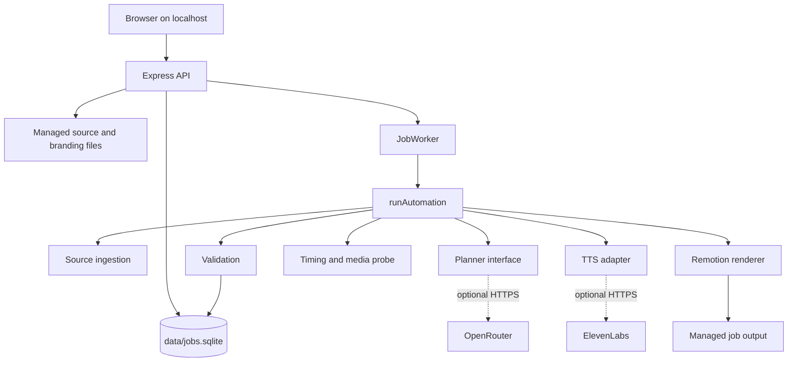

# Architecture

## System boundary

The application is a local Express server, a browser UI, a SQLite job repository, a worker, a shared automation engine, and a Remotion renderer. It is not a hosted multi-user service in the current repository.



## Important modules

| Module | Responsibility |
| --- | --- |
| `src/server/app.ts` | Local-only HTTP routes, input validation, job creation, settings, branding, artifacts |
| `src/server/repository.ts` | SQLite jobs, events, claims, state changes, retries, cancellation |
| `src/server/worker.ts` | Polling worker, source snapshots, stage events, engine invocation, safe failure handling |
| `src/server/ingestion/` | Local/remote source validation and text extraction |
| `src/server/security.ts` | URL policy, path confinement, safe error messages |
| `src/automation/main.ts` | Shared orchestration for CLI and UI jobs |
| `src/automation/hybrid-inputs.ts` | Capability resolution, external narration, user-video plan, asset staging |
| `src/automation/planner-openrouter.ts` | OpenRouter request, structured response, cache, retries, validation |
| `src/automation/tts-elevenlabs.ts` | TTS request/cache and character-timestamp alignment |
| `src/automation/branding.ts` | Branding resolution, QR generation, frame insertion |
| `src/automation/render.ts` | Remotion bundle, composition selection, poster/video render, render receipt |
| `src/automation/validate.ts` | Final media checks |
| `src/compositions/DynamicVideo.tsx` | Data-driven Remotion composition |

## Data contracts

The central contracts are Zod-backed types in `src/automation/types.ts` and server interfaces in `src/server/contracts.ts`.

- `VideoPlan` is the renderer’s authored scene contract.
- `VideoProps` combines plan, theme, audio, mix, branding, and runtime hybrid assets.
- `HybridInputs` describes visual and narration authority.
- `NormalizedSource` describes extracted content and provenance.
- `Job` and `JobEvent` describe persistent lifecycle state.

The UI receives safe structured job detail data. It does not receive raw provider responses, environment values, arbitrary server paths, or unrestricted output directory listings.

## Storage layout

```text
data/jobs.sqlite
inputs/job-uploads/<id>/
  original source or managed media
  normalized.json
output/jobs/job-<id>/
  source.md
  metadata.json
  video-plan.json
  render-plan.json
  voiceover.txt
  audio/
  renders/
  validation.json
public/branding/
public/generated/<slug>/
```

The worker uses managed job directories and validates any managed hybrid asset reference as a plain filename before joining it to the job directory. Render-time public references are relative asset names, not absolute paths.

## Concurrency model

The UI worker can claim jobs up to its configured concurrency, but `engineAdapter` serializes the shared renderer section because generated public assets and the renderer lock are shared. The current Settings UI describes the existing video engine as one job at a time. Source ingestion has separate bounded upload handling.

## Security boundaries

- The server accepts only localhost/loopback hosts and rejects cross-origin requests.
- Remote sources require HTTPS on port 443 without URL credentials.
- DNS results must be public unicast addresses; local/private and metadata networks are rejected.
- Redirects are revalidated and limited; downloads have time and size limits.
- Upload names cannot contain directory paths or control characters.
- Source types, file signatures, media streams, and extracted text are checked.
- Artifacts are confined to managed directories and only validated outputs are downloadable.
- Error messages redact provider secrets, bearer tokens, and local paths.

## Extension points

The safest extension points are the existing interfaces: `Planner`, injected runner dependencies, `Engine`, `VideoPlan` schema, source ingestion adapters, and the renderer’s scene map. New behavior should preserve source identity, explicit authority, deterministic timing, provider boundaries, and final validation.

