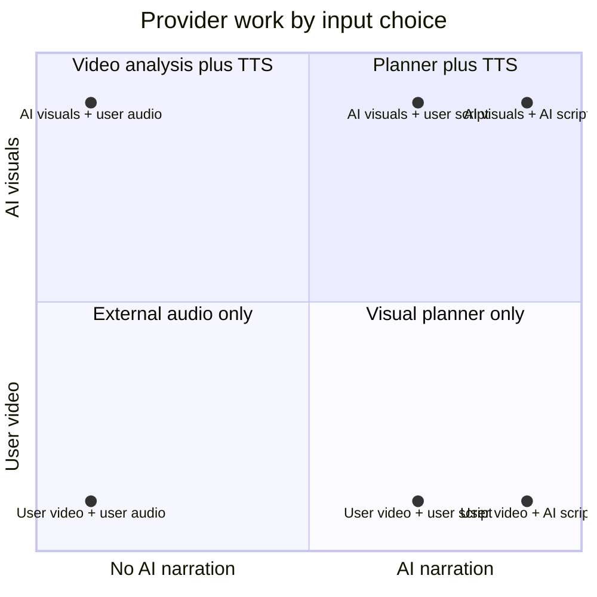

# Input Matrix

## Six supported choices

| # | Visual choice | Narration choice | Needs source document/URL | Needs uploaded video | Needs uploaded script | Needs uploaded audio | OpenRouter action | ElevenLabs action |
| ---: | --- | --- | --- | --- | --- | --- | --- | --- |
| 1 | AI visuals | AI-generated narration | Yes | No | No | No | Plan visuals and narration | Generate speech |
| 2 | AI visuals | My narration script | Yes | No | Yes | No | Plan visuals only; do not receive script text | Generate speech from exact script |
| 3 | AI visuals | My narration audio | Yes | No | No | Yes | Plan visuals only | Skip |
| 4 | Existing video | AI-generated narration | No source document required for visual content | Yes | No | No | Analyze supplied video for narration | Generate speech from analysis |
| 5 | Existing video | My narration script | No source document required for visual content | Yes | Yes | No | Skip planner and video analysis | Generate speech from exact script |
| 6 | Existing video | My narration audio | No source document required for visual content | Yes | No | Yes | Skip planner and video analysis | Skip |

## Detailed behavior

| Combination | Visual output | Narration authority | Timing behavior |
| --- | --- | --- | --- |
| AI + AI script | Remotion scenes selected from supported scene types | AI plan, locally validated | TTS timestamps and measured duration align scenes |
| AI + user script | Remotion scenes from source | User script is exact | Script is divided across scenes unchanged; TTS duration is measured |
| AI + user audio | Remotion scenes from source | User audio | External audio duration can extend auto mode; no TTS |
| User video + AI script | Uploaded video between branding slots | Video analysis output | Analysis narration goes to TTS; final audio is measured |
| User video + user script | Uploaded video between branding slots | User video and exact script | Script goes to TTS; visual plan is minimal |
| User video + user audio | Uploaded video between branding slots | User video and user audio | External audio is measured; no planning or TTS |

## Required files and formats

- Source documents: `.md`, `.txt`, `.pdf`, `.docx`, `.pptx`.
- User video: `.mp4`, `.webm`, `.mov`.
- User narration audio: `.mp3`, `.wav`, `.m4a`, `.aac`, `.ogg`, `.webm`.
- Remote sources: HTTPS only, without credentials, on port 443.

## What the authority wording means

“Authoritative” means the pipeline must use the supplied material as the source of truth for that part of the output. It does not mean the file is guaranteed to be semantically correct, short enough, or technically renderable. The system still validates file type, probes media, checks timing, and validates the final MP4.

## Provider-call summary

The diagram is a summary of the implemented capability resolver; it does not imply a provider call in preview, offline, or test mode.

