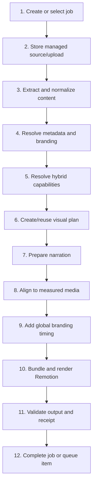
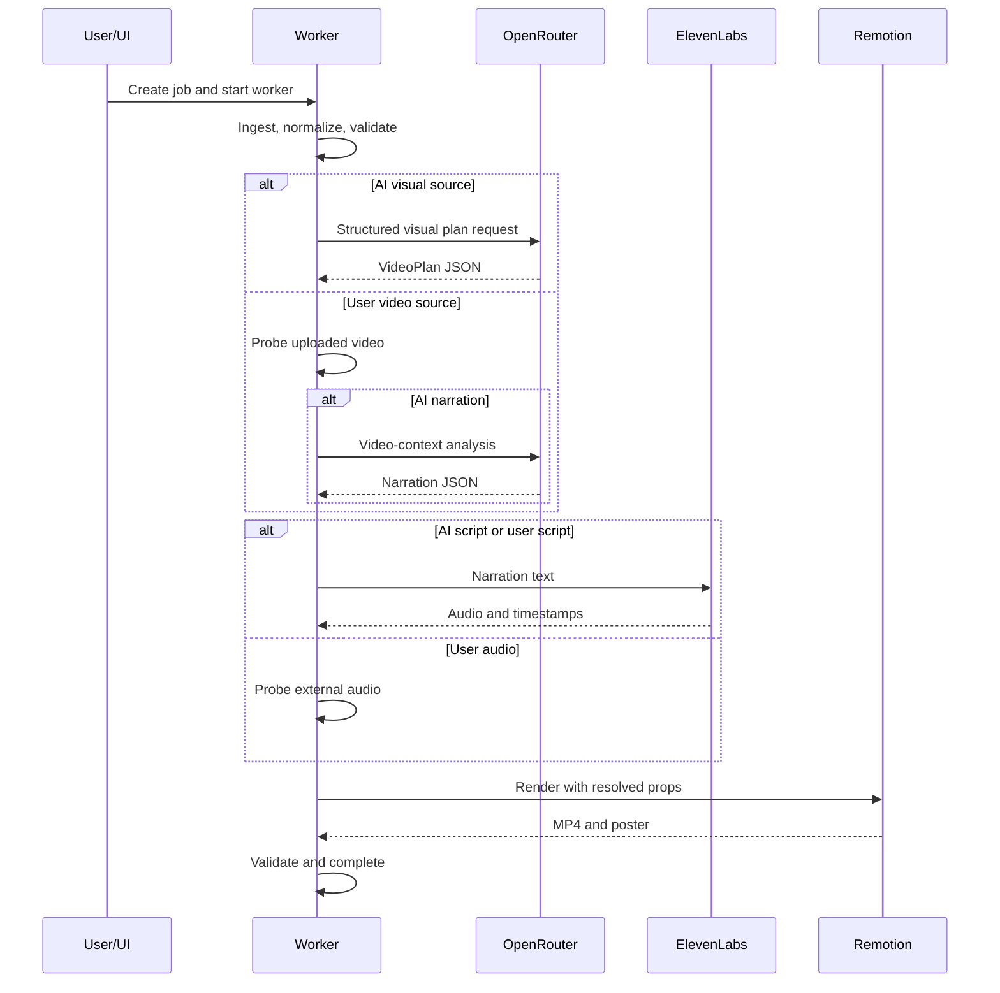

# Pipeline Flow

## End-to-end stages

## Stage details

### 1. Create or select job

The UI creates a job from a file, URL, or Hybrid Inputs multipart request. The CLI selects a pending bullet from `video-source.md` or accepts a standalone `--source`.

### 2. Store managed source/upload

Local source files are copied into the job directory. Hybrid video and narration audio are stored there too. Remote URLs retain their reference and are fetched when the worker processes them.

### 3. Extract and normalize content

Text, Markdown, webpages, PDFs, DOCX, and PPTX become `NormalizedSource`. The process records source type, original reference, extracted sections, title, provenance, and warnings. Video is handled by the Hybrid Inputs path rather than ordinary document extraction.

### 4. Resolve metadata and branding

The resolver combines frontmatter, source title, config defaults, theme catalog, and global brand identity. Job-level branding overrides are resolved and then snapshotted.

### 5. Resolve hybrid capabilities

The capability resolver determines whether the job needs a visual planner, video analysis, TTS, user-video staging, user-script injection, or user-audio staging.

### 6. Create or reuse visual plan

AI visual jobs call or reuse a planner result. User-video jobs probe the video and create a minimal user-video plan. External narration causes the AI planner to plan visuals without generating narration text.

### 7. Prepare narration

AI narration or user script is checked for spoken-text suitability and budget, then sent to ElevenLabs when rendering is requested. User audio is measured and bypasses TTS. `--plan-only` stops before TTS and render.

### 8. Align to measured media

Measured TTS timestamps or external audio duration update scene frames. Auto duration can grow. Fixed duration rejects media that cannot fit. Nothing is sped up.

### 9. Add global branding timing

Resolved intro/outro frames are added around the authored plan. The branding layer also prepares an optional QR SVG and public branding asset references.

### 10. Bundle and render Remotion

The renderer bundles the project, selects `DynamicVideo`, creates a poster, renders a temporary H.264/AAC MP4, and probes it before promotion to `final.mp4`.

### 11. Validate output and receipt

Validation checks playable video, dimensions, FPS, duration tolerance, frame count, audio stream, voiceover fit, render success, and receipt hash. `validation.json` records the checks.

### 12. Complete job or queue item

The UI repository marks the job `COMPLETED` only after validation and receipt verification. The CLI adds `<!-- done -->` only after the same gate. Failures remain visible with stage and safe error message.

## Provider-call map

Preview, offline, and test fixtures replace provider calls with local behavior. Real provider calls happen only when the selected mode needs them and the worker is allowed to run.

